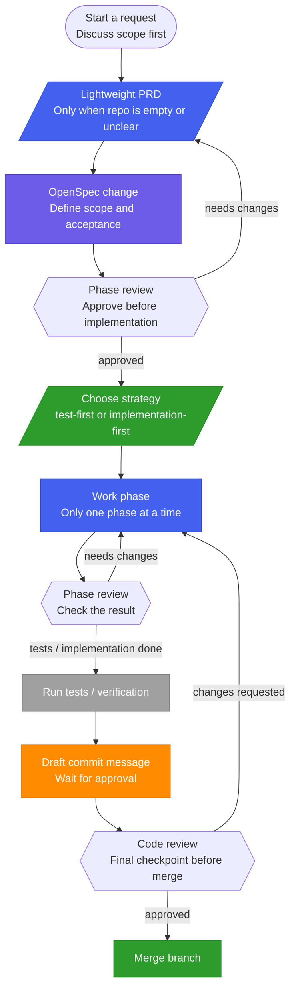

# spec-review-workflow

This setup is a main-session OpenSpec workflow.

The current chat session does the work phase by phase.
It supports both `test-first` and `implementation-first`.

## Flowchart



## Intended usage

In a project session, say something like:

```text
請用 spec-review-workflow。
先跟我討論需求，用 openspec 定 spec。
每個階段結束都停下來讓我審查。
```

## Workflow

1. Main session discusses the request.
2. Empty repo or unclear structure starts with Lightweight PRD and `docs/prd.md`.
3. After PRD approval, the session creates OpenSpec files and validates them.
4. The session stops for spec review.
5. The session chooses `test-first` or `implementation-first` and explains why.
6. The session stops after each phase for your phase review.
7. The session runs tests.
8. The session drafts the commit message with `git-commit-style`.
9. The session shows the draft and files, then waits for approval before commit.
10. The session runs code review as the final checkpoint before merge.
11. Only after code review approval, the session merges the branch.

## Lightweight PRD

See [core/references/prd_template.md](core/references/prd_template.md).

## Development strategy

Use `test-first` for precise logic and `implementation-first` for exploratory work. Explain the choice; ask for approval when the task is ambiguous or mixed.

## Branch Scope

Use one branch for one coherent change. Split branches only when changes are unrelated or should ship separately. Tiny low-risk edits do not need a new branch unless you want isolation.

## GitLab Remote

When you ask for `remote` or `push`, the agent should use the existing local Git auth for the target account if it is already configured. It should not ask for credentials again. If the target repo is not yet known, it should only ask for the repo target before setting the remote or pushing. It should not expose, print, or modify credentials unless you explicitly ask.

## SSH Key Defaults

Use `~/.ssh/id_ed25519` as the company key on this machine unless you say otherwise. Use `~/.ssh/id_ed25519_personal` as the personal GitHub key on this machine unless you say otherwise.

## GitLab Remote Creation

If the GitLab repo does not exist yet, the agent should ask for or infer the target namespace/group, project name, and whether to use the current local repo name. It should use a default company namespace only when you have not specified another target. If the target is still ambiguous, it should stop and ask before creating the remote repo.

## Phase rules

See [core/references/review_checklist.md](core/references/review_checklist.md) and [core/references/python_env.md](core/references/python_env.md).

## OpenSpec Gate

When this workflow is active, OpenSpec is required before tests or implementation unless you explicitly approve skipping it for a trivial existing-project change.

## PRD Gate

If you are discussing PRD, requirements, scope, planning, or product direction, the agent must not implement yet.

If the repo is empty, the agent should ask whether it should stay local or be linked to an existing remote repo before creating branches or OpenSpec files.

## Code Review

Code review here means the local checklist-based check for logic, safety, edge cases, test coverage, and scope. It is not the same as an external PR review.

Code review is the final checkpoint before merge. Do not merge until code review is explicitly approved. Do not treat a quick code skim or a test run as code review.

## Phase Review

Phase review means the stop after each phase to confirm direction before continuing.
